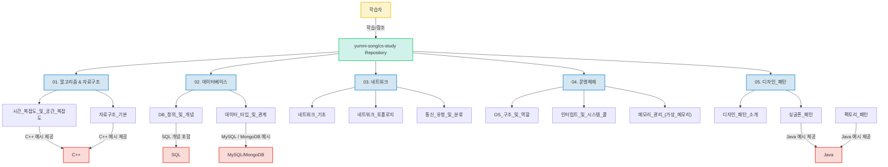

# 컴퓨터 공학 핵심 지식 학습 저장소 (CS Study Repository)


## 프로젝트 소개

이 저장소는 컴퓨터 공학의 핵심 기본 지식을 체계적으로 학습하고 정리하기 위한 목적으로 기획되었습니다. 알고리즘 및 자료구조부터 운영체제, 네트워크, 데이터베이스, 디자인 패턴에 이르기까지, 개발자가 갖춰야 할 필수 CS 지식을 깊이 있게 다룹니다.

각 주제는 독립적인 Markdown 문서로 구성되어 있으며, 이론 설명과 함께 C++, Java, SQL 등의 프로그래밍 언어를 활용한 실질적인 예시 코드를 제공하여 개념 이해를 돕습니다. 본 프로젝트는 시스템 아키텍트 지망생이나 초보 개발자가 CS 기초를 탄탄히 다지고, 이를 통해 기술 면접 및 포트폴리오를 준비하는 데 유용한 자료가 될 것입니다.

## 주요 기능

*   **컴퓨터 공학 핵심 지식 광범위 학습**: 알고리즘, 자료구조, 운영체제, 네트워크, 데이터베이스, 디자인 패턴 등 주요 CS 분야를 포괄적으로 학습할 수 있습니다.
*   **체계적인 학습 콘텐츠 제공**: 각 주제별로 독립적인 Markdown 문서를 통해 개념 정의, 상세 설명, 관련 용어 해설 등을 제공합니다.
*   **실제 코드 예시 포함**: C++, Java, SQL 등의 프로그래밍 언어를 활용한 예시 코드를 포함하여 이론적 개념을 실제 프로그래밍과 연결하고 이해를 돕습니다.
*   **포트폴리오 및 면접 준비 활용**: 개발 역량의 기반이 되는 CS 기초 지식 정리 및 확인을 통해 포트폴리오 강화 및 기술 면접 대비에 활용할 수 있습니다.

## 프로젝트 구조

본 프로젝트는 특정 애플리케이션의 소스 코드 구조보다는, 컴퓨터 공학 지식을 주제별로 분류하여 체계적으로 학습할 수 있도록 구성된 '지식 저장소'입니다. 각 주요 컴퓨터 공학 분야(예: `algorithm`, `database`, `network`, `operating system`, `design pattern`)가 별도의 논리적 섹션을 구성하며, 각 섹션 내에는 세부 주제를 다루는 개별 Markdown 문서들이 포함되어 있습니다.

```
.
├── README.md              # 프로젝트 소개 및 가이드 문서
├── algorithm/             # 알고리즘 및 자료구조 학습 자료
├── database/              # 데이터베이스 학습 자료
├── design pattern/        # 디자인 패턴 학습 자료
├── network/               # 네트워크 학습 자료
└── operating system/      # 운영체제 학습 자료
```

## 핵심 파일 설명

이 프로젝트의 핵심 파일들은 다음과 같은 역할을 수행합니다:

1.  `README.md`: 이 저장소의 가장 중요한 진입점 파일입니다. 프로젝트의 전반적인 소개, 학습 목표, 콘텐츠 구성, 사용 방법 등에 대한 정보를 담고 있을 것으로 추정됩니다. (현재 제공된 내용에는 비어 있음)
2.  `[주제]/[세부 주제] (N).md` (예: `algorithm/자료구조 (1).md`, `database/데이터베이스 (1).md`, `design pattern/디자인 패턴 (1).md`, `network/네트워크 (1).md`, `operating system/운영체제 (1).md`):
    *   이 파일들은 프로젝트의 실제 학습 콘텐츠를 구성합니다. 각 파일은 특정 컴퓨터 과학 주제의 세부 개념(예: 자료구조의 기본, 데이터베이스의 엔터티, 싱글톤 패턴, 네트워크 토폴로지, 운영체제의 인터럽트)을 다룹니다.
    *   각 파일 내에는 개념 정의, 상세 설명, 관련 용어 해설, 그리고 C++, Java, SQL 등의 프로그래밍 언어를 사용한 예시 코드 및 그림(마크다운 형식상 추정) 등이 포함되어 있어, 독자가 해당 개념을 깊이 있게 이해하는 데 필요한 모든 정보를 제공합니다.

## 기술 스택

*   **프로그래밍 언어**:
    *   **C++**: 자료구조 및 알고리즘의 로우레벨 구현과 성능 분석 이해에 기여합니다.
    *   **Java**: 객체지향 설계 원칙과 디자인 패턴의 실제 적용 사례를 학습하는 데 용이합니다.
    *   **SQL**: 관계형 데이터베이스의 기본 개념과 데이터 조작 언어의 핵심을 이해하는 데 도움을 줍니다.
*   **데이터베이스 기술**:
    *   **MySQL**: 널리 사용되는 관계형 데이터베이스의 구조와 데이터 타입 학습을 통해 실무 DB 지식 습득에 활용됩니다.
    *   **MongoDB**: NoSQL 데이터베이스의 유연한 모델과 RDBMS와의 차이점을 비교 학습하여 다양한 데이터 저장 방식 이해를 돕습니다.
*   **핵심 CS 도메인**:
    *   **알고리즘 및 자료구조**: 문제 해결 능력과 코드 효율성 최적화의 기반을 다지는 데 필수적입니다.
    *   **운영체제**: 컴퓨터 시스템의 근본적인 동작 원리를 이해하여 안정적인 서비스 설계 능력 향상에 기여합니다.
    *   **네트워크**: 분산 시스템 및 웹 서비스 통신의 기본 원리를 파악하여 견고한 시스템 구축에 기여합니다.
    *   **데이터베이스**: 데이터 관리 및 영속성 보장의 핵심 원리를 이해하여 데이터 기반 애플리케이션 개발 역량 강화에 활용됩니다.
    *   **디자인 패턴**: 객체지향 설계의 모범 사례를 학습하여 유연하고 확장 가능한 코드 작성 능력 배양을 돕습니다.

## 시스템 아키텍처

이 저장소는 실제 동작하는 애플리케이션의 시스템 아키텍처가 아닌, 컴퓨터 공학 핵심 지식을 체계적으로 학습하고 정리하기 위한 '지식 아키텍처'를 구성하고 있습니다. 사용자는 이 저장소를 통해 알고리즘, 자료구조, 운영체제, 네트워크, 데이터베이스, 디자인 패턴 등 주요 CS 분야의 기본 개념을 탐색하고 학습할 수 있으며, 각 주제는 독립적이면서도 상호 연관성을 가지고 지식의 깊이를 더하도록 설계되었습니다. 특히, C++, Java, SQL과 같은 프로그래밍 언어와 특정 데이터베이스(MySQL, MongoDB)는 개념 설명을 위한 예시 도구로 활용됩니다.

아래 다이어그램은 본 지식 저장소의 구조와 학습 흐름을 시각적으로 나타냅니다.



## 실행 방법

이 프로젝트는 코드 실행을 요구하는 애플리케이션이 아닌, 마크다운 기반의 학습 자료 저장소입니다. 따라서 별도의 '실행' 과정은 필요하지 않습니다. 각 마크다운 파일을 열람하여 학습 내용을 확인할 수 있습니다.

*   **추가 작성 필요**: 만약 예시 코드가 실행 가능한 형태(예: 컴파일 가능한 C++ 파일, Java 프로젝트)로 구성되어 있다면, 해당 언어별 컴파일 및 실행 방법이 추가적으로 기술될 수 있습니다.

## 기술 선택 이유

*   **C++**: 로우레벨 프로그래밍과 메모리 관리에 강점을 보여, 알고리즘 및 자료구조의 깊이 있는 이해와 성능 최적화 학습에 적합합니다.
*   **Java**: 객체지향 프로그래밍의 표준으로 널리 사용되며, 다양한 디자인 패턴과 엔터프라이즈 환경에서의 아키텍처 설계 학습에 용이합니다.
*   **SQL**: 관계형 데이터베이스의 핵심 언어로, 데이터 정의, 조작 및 제어의 기본 원리를 이해하고 실제 데이터베이스와 상호작용하는 능력을 기르는 데 필수적입니다.
*   **MySQL**: 가장 널리 사용되는 오픈소스 관계형 데이터베이스 중 하나로, 실제 서비스 환경에서 접할 수 있는 데이터베이스 구조와 운영 방식을 학습하는 데 실용적입니다.
*   **MongoDB**: NoSQL 데이터베이스의 대표적인 예시로, 유연한 문서 기반 데이터 모델을 통해 RDBMS와의 차이점을 이해하고 다양한 데이터 저장 시나리오를 학습하는 데 도움을 줍니다.

이 README 파일은 [25-26 GDGoC Sookmyung Build with AI](https://github.com/yeverycode/Agent) GitHub 분석 에이전트에 의해 작성되었습니다.
